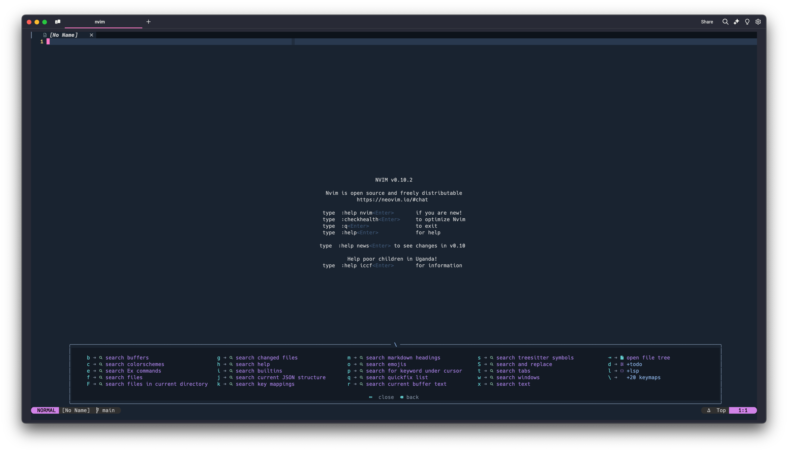
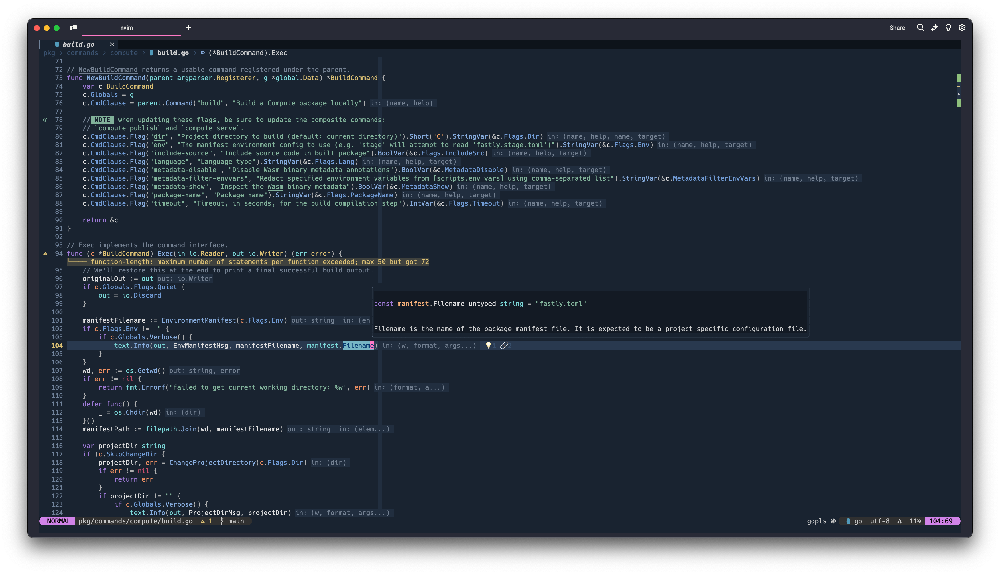
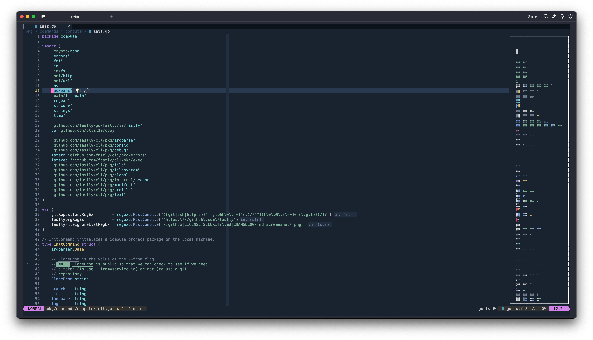
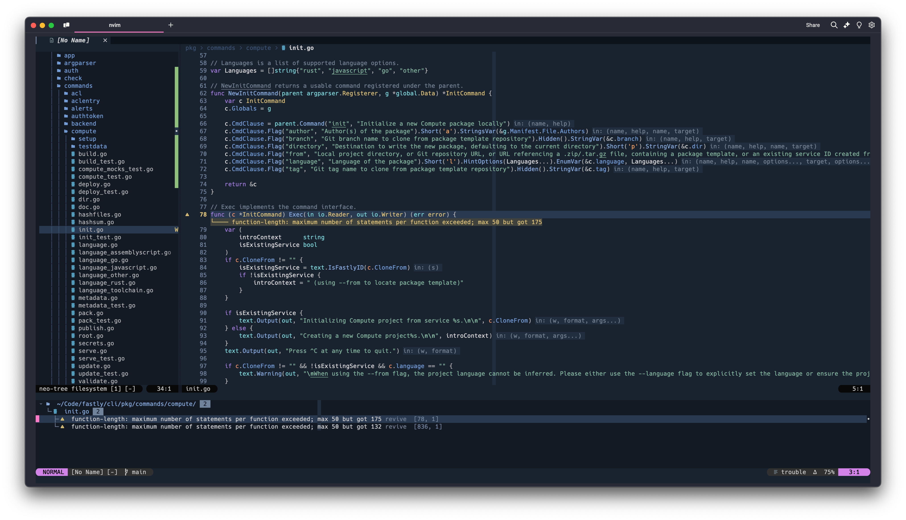
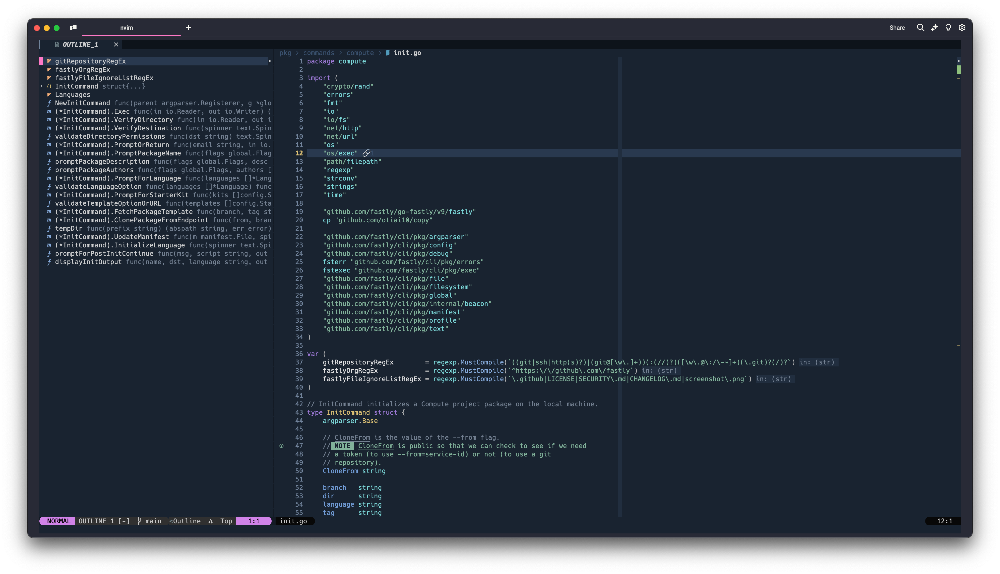
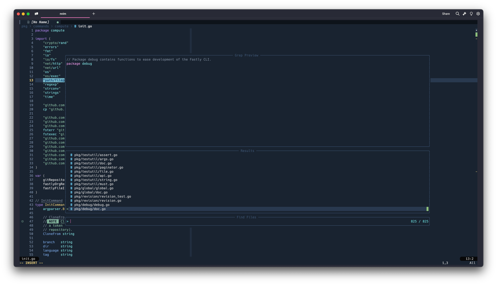
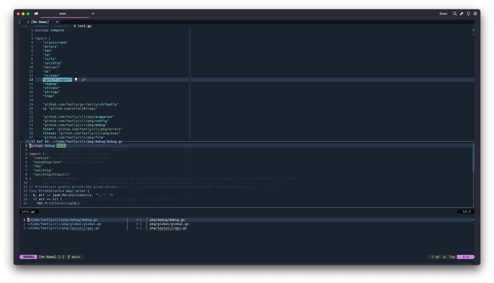

## Installation

Download these files into `~/.config/nvim/`

## Screenshots

Opening neovim you'll see the traditional screen + you can see the which-key
plugin is available:

> \[!TIP\]
> The `<leader>` key is `\`.\
> A single `<leader>` is for "searching".\
> A double `<leader>` is for other types of actions.\
> See the which-key output for each to understand what's available.



LSP support for Go and Rust + custom lualine implementation + breadcrumb trail
in the winbar:



A mini-map can be activated via key mapping:



A traditional file structure navigation is available + LSP diagnostics shown:



An AST navigation view for the symbols in the file is available:



Telescope is used heavily for searching for all sorts of data:



The quickfix workflow is also improved via a plugin:



## Directory Structure

```
.
├── after
│   ├── ftplugin
│   │   └── *.vim
│   └── syntax
│       └── *vim
├── ftdetect
│   └── *.vim
├── init.lua
├── lua
│   ├── autocommands.lua
│   ├── commands.lua
│   ├── custom
│   │   └── example
│   │       └── *.lua
│   ├── highlights.lua
│   ├── mappings.lua
│   ├── plugins
│   │   ├── *.lua
│   ├── quickfix.lua
│   └── settings.lua
├── spell
│   ├── en.utf-8.add
│   └── en.utf-8.add.spl
└── syntax
    └── qf.vim
```

### ftdetect

Determines the filetype of a buffer when it's first opened.

- Global: `$VIMRUNTIME/ftdetect/<filetype>.vim` or `*.lua`.
- User-defined: `~/.config/nvim/ftdetect/<filetype>.vim` or `*.lua`

> \[!NOTE\]
> `ftdetect` doesn’t have an `after/` equivalent because once the filetype is
> set, it doesn't need to be adjusted again.

### ftplugin

Configures buffer-local settings after the filetype is detected and set by
ftdetect.

- Global: `$VIMRUNTIME/ftplugin/<filetype>.vim` or `*.lua`.
- User-defined: `~/.config/nvim/ftplugin/<filetype>.vim` or `*.lua`.
- After defined: `~/.config/nvim/after/ftplugin/<filetype>.vim` or `*.lua`.

> \[!NOTE\]
> Files in `/after/ftplugin/` are sourced after the regular `ftplugin` files.
> This allows overriding or extending previous filetype configurations without
> directly modifying them.

### spell

The `spell/` directory stores custom spelling dictionaries for different
languages or locales. It allows you to add custom words to the spellchecker
without modifying Neovim’s default spell files.

- `en.utf-8.add`: This is the plain-text list of additional words you’ve added
  to the spellchecker.
- `en.utf-8.add.spl`: This is the compiled spell file generated from the `.add`
  file, which helps speeds up spellchecking.

> \[!TIP\]
> Hover over a misspelled word and press `zg` to add it to the custom
> dictionary. The word gets saved to `~/.config/nvim/spell/en.utf-8.add`.
> Alternatively, type `z=` to see suggestions.

<!---->

> \[!TIP\]
> An optional (but recommended) step is to compile the spell file:\
> `mkspell ~/.config/nvim/spell/en.utf-8.add`

### syntax

The `syntax/*.vim` or `*.lua` files define syntax highlighting rules for
different filetypes.

- Global: `$VIMRUNTIME/syntax/<filetype>.vim` or `*.lua`.
- User-defined: `~/.config/nvim/syntax/<filetype>.vim` or `*.lua`.
- After defined: `~/.config/nvim/after/syntax/<filetype>.vim` or `*.lua`.

### after

When you install plugins with `lazy.nvim` (or `packer`, `vim-plug`, etc.), those
plugins typically place their configuration files in:

```plain
~/.local/share/nvim/lazy/<plugin-name>/
```

These plugin files live in the global runtime path (`$VIMRUNTIME`) and are
sourced automatically by Neovim.

Files in `/after/` are sourced after plugin files, allowing you to:

- Override plugin settings (like buffer options, keymaps).
- Add extra configurations that build on top of the plugin’s defaults.
- Fix incompatibilities between plugins or conflicts in configuration.

As an example, when configuring an LSP server, you would have your setup code
in:

```plain
~/.config/nvim/lua/plugins/lsp.lua
```

While adding any LSP specific modifications into:

```plain
~/.config/nvim/after/plugin/lsp.lua
```

So `.setup()` calls configure plugins globally, whereas `ftplugin` is
filetype-specific. If you place `.setup()` in `ftplugin/`, it will only run when
a file of that type is opened, which can lead to incomplete or missing
configurations.
